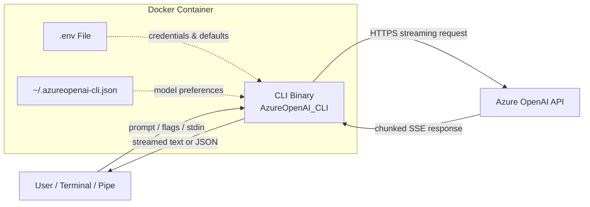
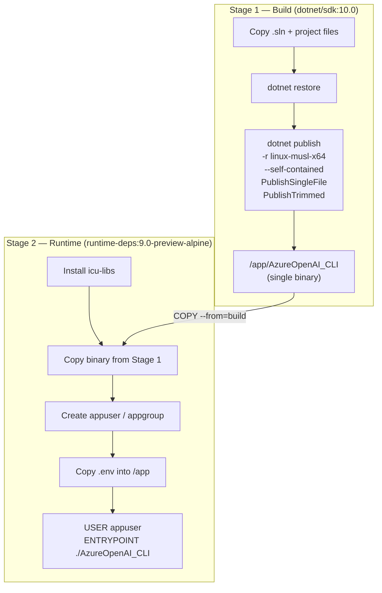
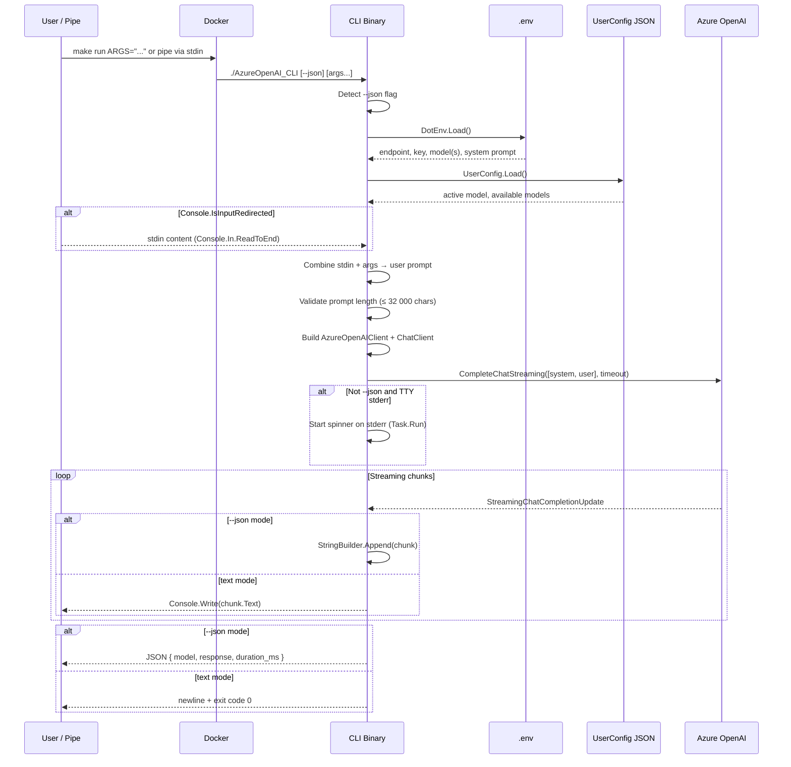
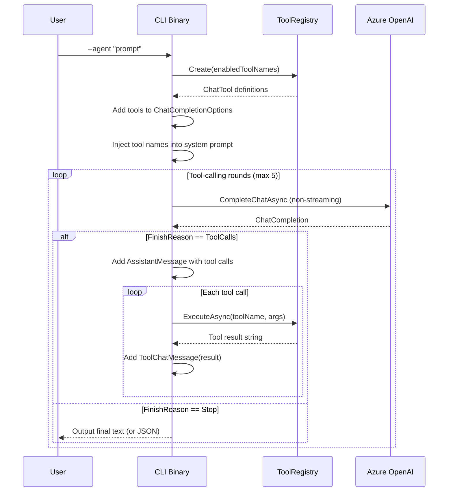
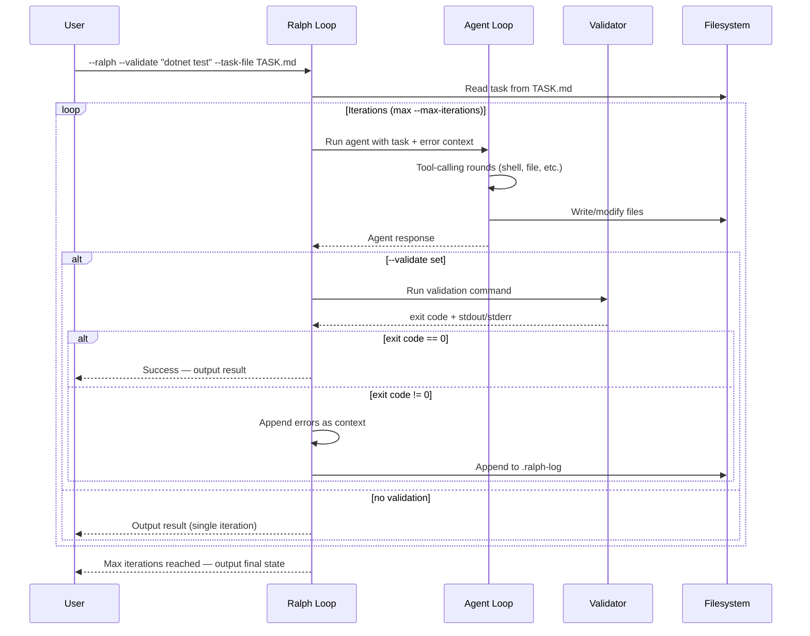
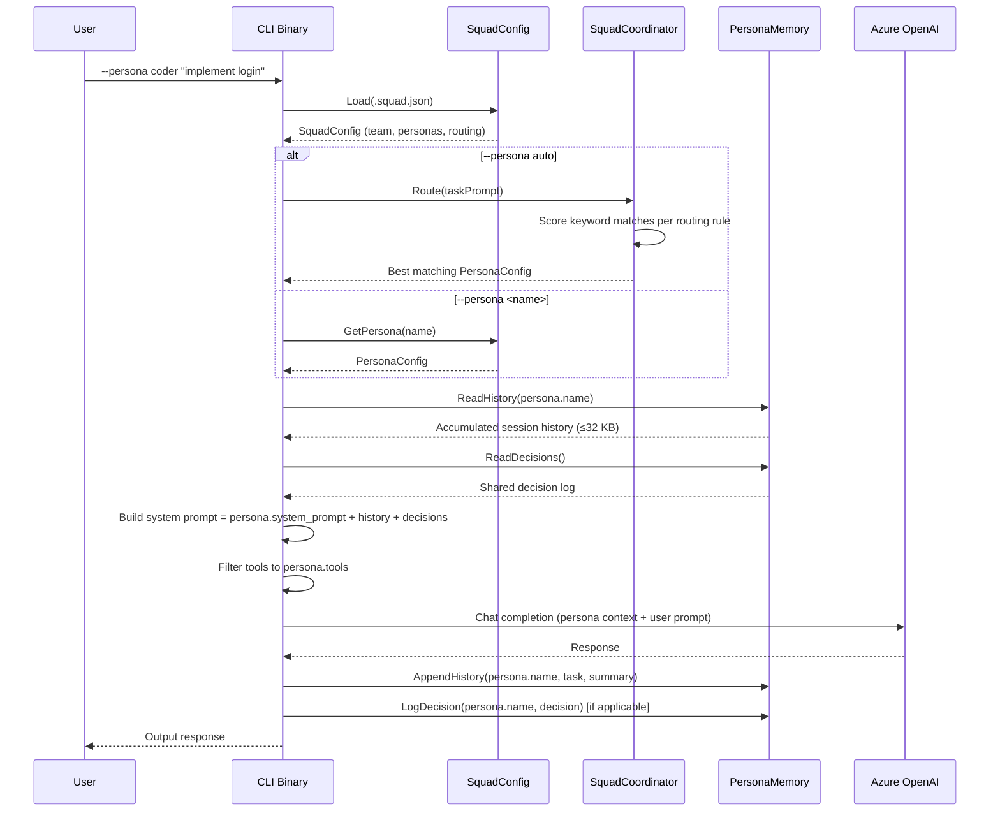

# Architecture

## 1. Overview

Azure OpenAI CLI is a secure, containerized command-line interface for interacting with Azure OpenAI services. It is built with .NET 10, packaged as a self-contained single-file binary, and distributed through Docker or native `dotnet run`.

### Design Philosophy

- **Simplicity** — A single binary with no external runtime dependencies. Arguments are the prompt; the response streams to stdout.
- **Speed** — Primary use case is AHK/Espanso text injection where latency matters. Without `--agent`, zero tool overhead.
- **Security** — Runs as a non-root user inside a minimal Alpine container. Credentials injected at runtime via `--env-file`, never baked into images.
- **Opt-in Complexity** — `--agent` activates tool-calling; without it, the CLI behaves identically to v1.0.
- **Containerization** — Docker is the primary distribution mechanism, ensuring reproducible builds and isolated execution across Windows, macOS, and Linux.

---

## 2. System Architecture



| Component | Responsibility |
|---|---|
| **User / Terminal** | Invokes the container via `make run` or the `az-ai` alias. |
| **Docker Container** | Provides isolation, non-root execution, and a reproducible runtime. |
| **CLI Binary** | Parses arguments, loads configuration, calls Azure OpenAI, and streams the response. |
| **.env File** | Supplies Azure endpoint, API key, model deployment name(s), and system prompt. |
| **UserConfig JSON** | Persists the user's active model selection across invocations. |
| **Azure OpenAI API** | Microsoft-hosted LLM inference endpoint. |

---

## 3. Component Details

### Program.cs — Entry Point

`Program.cs` contains the entire request lifecycle in a single `Main` method plus helper methods for command routing.

#### Startup sequence

1. **Load `.env`** — Uses `dotenv.net` to read the `.env` file baked into the container, overwriting any pre-existing environment variables.
2. **Load UserConfig** — Deserializes `~/.azureopenai-cli.json` (if it exists) to retrieve saved model preferences.
3. **Initialize models** — Parses the `AZUREOPENAIMODEL` environment variable (comma-separated) and reconciles it with the persisted config.

#### `--json` output mode

When the first argument is `--json`, the flag is consumed and the CLI switches to machine-readable output:

- A `StringBuilder` collects all streamed tokens instead of printing them to stdout.
- A `Stopwatch` records wall-clock duration from the first API call.
- On success, a JSON object is written to stdout: `{ "model", "response", "duration_ms" }`.
- On error, the `OutputJsonError(message, exitCode)` helper emits `{ "error": true, "message", "exit_code" }`.

#### `--version` command

`--version` / `-v` reads the assembly version via `Assembly.GetEntryAssembly()?.GetName().Version` and prints `Azure OpenAI CLI v<major.minor.patch>`.

#### Stdin pipe support

The CLI detects piped input with `Console.IsInputRedirected` and reads it via `Console.In.ReadToEnd()`.

| Scenario | Resulting prompt |
|---|---|
| Args only | `string.Join(' ', args)` |
| Stdin only | Raw stdin content |
| Stdin + args | `"{stdin}\n\n{args}"` — piped content first, then the user instruction |
| Neither | Show usage / JSON error; exit `1` |

The combined prompt is validated against `MAX_PROMPT_LENGTH` (32 000 chars) before being sent to the API.

#### Spinner

While waiting for the first token from Azure, a braille spinner (`⠋⠙⠹⠸⠼⠴⠦⠧⠇⠏`) animates on stderr:

- Launched as a background `Task.Run` with its own `CancellationTokenSource`.
- Writes exclusively to `Console.Error` so stdout remains clean for piping.
- Suppressed when stderr is redirected (`Console.IsErrorRedirected`), stdout is piped (`Console.IsOutputRedirected`), in `--json` mode, or in `--raw` mode.
- Cancelled and cleared (with a carriage-return overwrite) as soon as the first token arrives.

#### CLI flags

| Flag | Description |
|---|---|
| `--help`, `-h` | Show usage information |
| `--version`, `-v` | Show assembly version |
| `--json` | Output response as JSON (for scripting) |
| `--models`, `--list-models` | List available models (`→` / `*` marks active) |
| `--current-model` | Show the currently active model |
| `--set-model <name>` | Switch the active model |
| `--agent` | Enable agentic mode with tool-calling |
| `--tools <list>` | Restrict available tools (comma-separated) |
| `--max-rounds <n>` | Limit tool-calling iterations (default: 5) |
| `--ralph` | Enable autonomous Wiggum loop (implies `--agent`) |
| `--validate <cmd>` | Validation command for Ralph loop iterations |
| `--task-file <path>` | Read task prompt from file |
| `--max-iterations <n>` | Ralph loop iteration limit (default: 10, max: 50) |
| `--squad-init` | Scaffold `.squad.json` and `.squad/` directory with default team |
| `--persona <name>` | Select a named persona (or `auto` for keyword routing) |
| `--personas` | List available personas from `.squad.json` |
| `--raw` | Suppress all formatting (no spinner, no newline, no stderr). For Espanso/AHK |

#### Command routing

| Argument | Action | Exit Code |
|---|---|---|
| `--models` / `--list-models` | Print available models; mark the active one with `→` and `*`. | `0` |
| `--current-model` | Print the active model name. | `0` (set) / `1` (unset) |
| `--set-model <name>` | Validate the name against available models, persist the choice. | `0` (success) / `1` (error) |
| `--version` / `-v` | Print assembly version. | `0` |
| `--help` / `-h` | Print usage information. | `0` |
| _(any other text)_ | Treated as a prompt — all args are joined with spaces. | `0` (success) / non-zero on error |
| _(no args)_ | Print usage information (or JSON error in `--json` mode). | `1` |

#### Chat completion flow

1. Build an `AzureOpenAIClient` with the endpoint URI and API key credential.
2. Obtain a `ChatClient` scoped to the active deployment name.
3. Read `AZURE_MAX_TOKENS`, `AZURE_TEMPERATURE`, and `AZURE_TIMEOUT` from environment variables (with fallback defaults).
4. Construct a `ChatCompletionOptions` with those values (`TopP=1.0`, `FrequencyPenalty=0.0`, `PresencePenalty=0.0`).
5. Send a two-message conversation (`SystemChatMessage` + `UserChatMessage`) via `CompleteChatStreaming`, wrapped in a `CancellationTokenSource` with the configured timeout.
6. Start the spinner on stderr (if TTY and not `--json` mode).
7. Iterate `StreamingChatCompletionUpdate` chunks, writing each content part to stdout in real time — or collecting them in a `StringBuilder` when `--json` is active.
8. On completion in `--json` mode, emit the JSON result with model name, full response text, and elapsed milliseconds.

#### Error handling & exit codes

Errors are caught at the top level and routed through `--json`-aware paths:

| Exit Code | Condition | Output |
|---|---|---|
| `0` | Success | Streamed text or JSON result |
| `1` | Validation / usage error (missing prompt, bad endpoint, prompt too long, unknown model) | `[ERROR]` on stderr or JSON error |
| `2` | Azure API error (`RequestFailedException`) — includes HTTP status and human-readable detail for 401/403/404/429 | `[AZURE ERROR]` on stderr or JSON error |
| `3` | Timeout (`OperationCanceledException`) — streaming exceeded `AZURE_TIMEOUT` seconds | `[ERROR]` on stderr or JSON error |
| `130` | User interrupt (CTRL+C) — `Console.CancelKeyPress` signals the top-level CancellationToken; Ralph flushes `.ralph-log`, Persona records `[cancelled]` in memory | `[cancelled]` on stderr |
| `99` | Unhandled exception | `[UNHANDLED ERROR]` on stderr or JSON error |

---

### UserConfig.cs — Configuration Manager

`UserConfig` manages persistent user preferences, stored as JSON at `~/.azureopenai-cli.json`.

#### Data model

```json
{
  "ActiveModel": "gpt-4o",
  "AvailableModels": ["gpt-4", "gpt-35-turbo", "gpt-4o"]
}
```

#### Key behaviors

| Method | Description |
|---|---|
| `Load()` | Reads and deserializes the config file. Returns a fresh instance if the file is missing or corrupt. |
| `Save()` | Serializes the current state to disk with indented JSON. Failures are logged to stderr as warnings. |
| `InitializeFromEnvironment(string?)` | Parses a comma-separated model string, deduplicates entries, and updates `AvailableModels`. Resets `ActiveModel` to the first entry if the current selection is no longer valid. |
| `SetActiveModel(string)` | Case-insensitive lookup against `AvailableModels`. Returns `true` on match, `false` otherwise. |

#### Thread safety

`UserConfig` is **not** thread-safe. It is designed for single-threaded CLI use — one invocation reads, optionally mutates, and writes the config file. Concurrent container invocations could race on the JSON file, but this is acceptable given the CLI's usage pattern.

---

## 4. Build Pipeline



### Publish flags explained

| Flag | Purpose |
|---|---|
| `-r linux-musl-x64` | Target Alpine's musl libc instead of glibc. |
| `--self-contained true` | Bundle the .NET runtime — no framework install required. |
| `/p:PublishSingleFile=true` | Produce a single executable file. |
| `/p:PublishTrimmed=true` | Remove unused framework code to reduce binary size. |
| `/p:IncludeAllContentForSelfExtract=true` | Embed all content for self-extraction at startup. |

### Makefile targets

| Target | Description |
|---|---|
| `make build` | Build the Docker image (`azureopenai-cli:gpt-5-chat`). |
| `make run ARGS="..."` | Run the CLI inside a fresh container with the given arguments. |
| `make clean` | Remove `bin/obj` directories, prune dangling images, and clean the Docker builder cache. |
| `make alias` | Append an `az-ai` shell alias to the user's RC file (`.zshrc`, `.bashrc`, or `.profile`). |
| `make scan` | Run Grype vulnerability scanner against the built image. |
| `make test` | Clean, build, then run a sample prompt ("Tell me some unusual facts about cats"). |
| `make check` | Build verification — creates a placeholder `.env` if needed, runs `make build`, then cleans up. |

---

## 5. Data Flow

### Prompt → Response (with stdin support)



### Configuration flow

```
.env file ──DotEnv.Load()──▶ Environment variables ──GetEnvironmentVariable()──▶ AzureOpenAIClient
                                                                                   │
AZUREOPENAIMODEL ──InitializeFromEnvironment()──▶ UserConfig.AvailableModels       │
                                                      │                            │
UserConfig.ActiveModel ────────────────────────────────┘──────────▶ deploymentName ─┘
```

---

### Agent Mode Data Flow

When `--agent` is used, the CLI enters an agentic loop where the model can call built-in tools:



#### Tool Architecture

```
IBuiltInTool (interface)
├── Name, Description, ParametersSchema
└── ExecuteAsync(JsonElement args, CancellationToken)

ToolRegistry
├── Register(IBuiltInTool)
├── Create(enabledTools?) → factory
├── ToChatTools() → List<ChatTool>
└── ExecuteAsync(name, json, ct)

Built-in tools:
├── ShellExecTool — /bin/sh -c, blocklist, 10s timeout, 64KB cap
├── ReadFileTool — File.ReadAllTextAsync, 1MB cap, blocked paths
├── WebFetchTool — HttpClient GET, HTTPS-only, 5s timeout
├── GetClipboardTool — xclip/xsel/pbpaste/PowerShell
├── GetDateTimeTool — DateTimeOffset, IANA timezone support
└── DelegateTaskTool — Spawn child CLI agent, depth-capped, 60s timeout
```

### Ralph Mode Data Flow (Wiggum Loop)

When `--ralph` is used, the CLI enters an autonomous self-correcting loop. Each iteration runs a full agent cycle, then optionally validates the result with an external command. If validation fails, errors are fed back as new context and the loop repeats.

```
┌─────────────────────────────────────────────────────────┐
│                    Ralph Loop (Wiggum)                   │
│                                                         │
│   ┌──────────┐    ┌────────────┐    ┌──────────────┐    │
│   │ Read Task │───▶│ Agent Loop │───▶│  Validation  │    │
│   │ (file or  │    │ (--agent   │    │ (--validate) │    │
│   │  args)    │    │  + tools)  │    │              │    │
│   └──────────┘    └────────────┘    └──────┬───────┘    │
│        ▲                                    │            │
│        │              ┌─────────┐     ┌─────▼─────┐     │
│        │              │  Error  │     │   Pass?   │     │
│        │              │ Context │◀────│ exit == 0 │     │
│        │              └────┬────┘     └─────┬─────┘     │
│        │                   │          (yes)  │           │
│        └───────────────────┘          ┌─────▼─────┐     │
│         (fail: loop again)            │  Output   │     │
│                                       │  Result   │     │
│                                       └───────────┘     │
└─────────────────────────────────────────────────────────┘
```



#### Ralph Loop Invariants

| Property | Value |
|---|---|
| **State persistence** | Via filesystem — each iteration reads/writes files directly |
| **Message history** | Stateless per iteration — fresh `[system, user]` messages each round |
| **Error feedback** | Validation stderr/stdout appended to user prompt as context |
| **Iteration log** | `.ralph-log` — JSON-lines file with iteration number, task, result, validation output |
| **Default iterations** | 10 (configurable via `--max-iterations`, hard cap at 50) |
| **Implies** | `--agent` (Ralph mode always enables agent mode) |

### DelegateTaskTool Architecture

The `delegate_task` tool enables subagent calling — the parent agent can spawn a child CLI instance to handle a subtask in isolation.

```
Parent Agent (depth 0)
│
├── delegate_task("write unit tests for auth.cs")
│   └── Child CLI (depth 1, RALPH_DEPTH=1)
│       ├── shell_exec, read_file, web_fetch, ...
│       └── delegate_task → Child CLI (depth 2, RALPH_DEPTH=2)
│           ├── shell_exec, read_file, ...
│           └── delegate_task → BLOCKED (depth 3, max reached)
│
└── shell_exec("dotnet test")
```

#### Delegation Mechanics

| Property | Value |
|---|---|
| **Tool name** | `delegate_task` (alias: `delegate`) |
| **Parameters** | `task` (required string), `tools` (optional comma-separated) |
| **Spawns** | `dotnet <dll> --agent --tools <tools> "<task>"` |
| **Depth tracking** | `RALPH_DEPTH` env var, incremented per level |
| **Max depth** | 3 (child at depth 3 has `delegate` removed from available tools) |
| **Timeout** | 60 seconds per child invocation |
| **Output cap** | 64 KB (consistent with ShellExecTool) |
| **Credential passthrough** | Azure env vars (`AZUREOPENAIENDPOINT`, `AZUREOPENAIAPI`, `AZUREOPENAIMODEL`) forwarded to child |
| **Default child tools** | All tools except `delegate` (prevents naive infinite recursion) |

### Persona System Data Flow (Squad)

When `--persona` is used, the CLI loads persona configuration and injects persona-specific context into the conversation:



#### Persona System Components

```
Squad/ (namespace: AzureOpenAI_CLI.Squad)
├── SquadConfig.cs         # .squad.json model (team, personas, routing rules)
├── SquadCoordinator.cs    # Keyword-based task routing (score + select)
├── SquadInitializer.cs    # Scaffold .squad.json + .squad/ directory
└── PersonaMemory.cs       # Per-persona history read/write, decision log
```

#### `.squad.json` Config Schema

```json
{
  "team": {
    "name": "string — team display name",
    "description": "string — team description"
  },
  "personas": [
    {
      "name": "string — unique identifier (lowercase)",
      "role": "string — human-readable role title",
      "description": "string — what this persona does",
      "system_prompt": "string — injected as system message",
      "tools": ["string — tool short names (shell, file, web, etc.)"],
      "model": "string? — optional model override per persona"
    }
  ],
  "routing": [
    {
      "pattern": "string — comma-separated keywords",
      "persona": "string — persona name to route to",
      "description": "string — human-readable rule description"
    }
  ]
}
```

#### Persona Memory Invariants

| Property | Value |
|---|---|
| **Storage** | `.squad/history/<name>.md` — one file per persona |
| **Max size** | 32 KB per persona (tail-truncated, most recent kept) |
| **Session entry** | Timestamp + task summary + result summary |
| **Shared log** | `.squad/decisions.md` — cross-persona decision record |
| **Initialization** | `--squad-init` creates `.squad/`, `history/`, and `decisions.md` |
| **Won't overwrite** | `--squad-init` is idempotent — returns false if `.squad.json` already exists |

---

## 6. Configuration Model

### Configuration sources

| Source | Variables | Purpose |
|---|---|---|
| `.env` file | `AZUREOPENAIENDPOINT` | Azure OpenAI resource URL |
| | `AZUREOPENAIAPI` | API key for authentication |
| | `AZUREOPENAIMODEL` | Comma-separated deployment name(s) |
| | `SYSTEMPROMPT` | System message prepended to every request |
| UserConfig JSON | `ActiveModel` | Currently selected model deployment |
| | `AvailableModels` | Full list of configured models |

### Environment variable overrides

These environment variables tune API request parameters. They are read via helper methods (`TryParseEnvInt`, `TryParseEnvFloat`) and fall back to sensible defaults when absent or unparseable.

| Variable | Default | Description |
|---|---|---|
| `AZURE_MAX_TOKENS` | `10000` | Maximum output tokens (`MaxOutputTokenCount`) |
| `AZURE_TEMPERATURE` | `0.55` | Response temperature (0.0 – 2.0) |
| `AZURE_TIMEOUT` | `120` | Streaming timeout in seconds (`CancellationTokenSource`) |

### Hardcoded defaults (in `Program.cs`)

These values are used when no environment variable override is set, or for parameters that have no environment variable:

| Parameter | Value | Overridable via |
|---|---|---|
| `MaxOutputTokenCount` | `10000` | `AZURE_MAX_TOKENS` |
| `Temperature` | `0.55` | `AZURE_TEMPERATURE` |
| `TopP` | `1.0` | — |
| `FrequencyPenalty` | `0.0` | — |
| `PresencePenalty` | `0.0` | — |
| `MAX_PROMPT_LENGTH` | `32000` | — (compile-time constant) |

### Precedence rules

1. **`.env` file** is loaded with `overwriteExistingVars: true`, so it takes priority over any pre-existing environment variables.
2. **`UserConfig.ActiveModel`** overrides the first model from `AZUREOPENAIMODEL` if the user has explicitly set a model with `--set-model`.
3. If `ActiveModel` is null or no longer in `AvailableModels`, the CLI falls back to the first entry in the model list.

---

## 7. Security Architecture

> See also [`SECURITY.md`](SECURITY.md) for the vulnerability reporting policy.

### Containerization boundary

- The CLI runs exclusively inside Docker — no host installation is supported.
- The Alpine base image (`runtime-deps:9.0-preview-alpine`) minimizes the attack surface.
- Only `icu-libs` is added at runtime; all other packages are stripped.

### Non-root execution

- A dedicated `appuser` / `appgroup` is created in the Dockerfile.
- The `USER appuser` directive drops privileges before the entrypoint runs.
- File permissions are explicitly set with `chown` and `chmod`.

### Credential handling

- API keys and endpoints live in the `.env` file, which is **baked into the image** at build time.
- The `.env` file is listed in `.gitignore` and never committed to version control.
- No credentials are stored in the `UserConfig` JSON file — it only holds model names.

### Tool security

All built-in tools enforce defense-in-depth input validation:

- **Parameter access hardening** — All tools use `TryGetProperty()` instead of `GetProperty()` for graceful handling of missing or malformed JSON parameters. This prevents `KeyNotFoundException` crashes when the model omits required fields.
- **SSRF redirect protection** — `WebFetchTool` validates the final URL after following HTTP redirects. If the redirect target resolves to a private IP range or uses a non-HTTPS scheme, the request is blocked. This defends against SSRF attacks where the initial URL passes validation but redirects to an internal resource.
- **Shell injection hardening** — `ShellExecTool` blocks shell substitution patterns (`$()`, backticks, `<()`, `>()`) and dangerous builtins (`eval`, `exec`). Uses `ArgumentList` instead of string-interpolated `Arguments` for proper OS-level escaping, preventing argument injection.
- Shell commands have a blocklist, 10-second timeout, and 64 KB output cap.
- File reads are restricted from sensitive paths and enforce a 1 MB size cap.
- Web fetches enforce HTTPS-only, DNS rebinding protection, and response size caps.
- Clipboard reads have size caps and use PATH-based command detection.
- Subagent delegation is depth-capped at 3 levels via `RALPH_DEPTH`.

---

## 8.5. Source-Generated JSON (AOT Strategy)

`JsonGenerationContext.cs` defines `AppJsonContext`, a `System.Text.Json` source generator context annotated with `[JsonSerializable]` for all serialized types:

- `UserConfig` — user preferences (`~/.azureopenai-cli.json`)
- `SquadConfig` — squad team configuration (`.squad.json`)
- `PersonaConfig` — individual persona definitions
- `ChatJsonResponse` — `--json` output for standard chat mode (`model`, `response`, `duration_ms`, `input_tokens`, `output_tokens`)
- `AgentJsonResponse` — `--json` output for agent mode (adds `rounds`, `tools_called`, `agent` metadata)
- All supporting Squad types (routing rules, team metadata)

### Why source generators?

Reflection-based `System.Text.Json` is incompatible with Native AOT — the trimmer removes the metadata that the serializer needs at runtime. Source generators emit serialization code at compile time, eliminating the reflection dependency entirely.

### Usage convention

All new JSON serialization **must** use `AppJsonContext` instead of default `JsonSerializer.Serialize<T>()` / `Deserialize<T>()` overloads. Use the typed context methods:

```csharp
// ✅ Correct — uses source-generated serializer
JsonSerializer.Serialize(config, AppJsonContext.Default.UserConfig);
JsonSerializer.Deserialize<UserConfig>(json, AppJsonContext.Default.UserConfig);

// ❌ Wrong — falls back to reflection (breaks AOT)
JsonSerializer.Serialize(config);
JsonSerializer.Deserialize<UserConfig>(json);
```

`UserConfig.cs` has already been migrated to use `AppJsonContext` for both `Load()` and `Save()`. The Dockerfile uses `PublishReadyToRun=true` for ~50% startup improvement as a stepping stone toward full AOT.

### Vulnerability scanning

- `make scan` runs [Grype](https://github.com/anchore/grype) against the built image.
- The Dockerfile comment recommends pinning image digests in production for supply-chain integrity.

---

## 8. Directory Structure

```
azure-openai-cli/
├── .github/
│   ├── ISSUE_TEMPLATE/
│   │   ├── bug_report.md            # Bug report template
│   │   └── feature_request.md       # Feature request template
│   ├── agents/                      # Copilot agent configuration
│   ├── pull_request_template.md     # PR template
│   └── workflows/
│       ├── ci.yml                   # CI pipeline (build + test)
│       └── release.yml              # Release pipeline (binaries + Docker + GitHub Release)
├── ARCHITECTURE.md                  # This file
├── CODE_OF_CONDUCT.md               # Community code of conduct
├── CONTRIBUTING.md                  # Contribution guidelines
├── Dockerfile                       # Multi-stage build (SDK → Alpine runtime)
├── IMPLEMENTATION_PLAN.md           # Development roadmap
├── LICENSE                          # Project license
├── Makefile                         # Build, run, clean, scan, alias targets
├── README.md                        # User-facing documentation
├── SECURITY.md                      # Vulnerability reporting policy
├── azure-openai-cli.sln             # .NET solution file
├── azureopenai-cli/                 # Application source
│   ├── .env.example                 # Template for Azure credentials
│   ├── .env                         # Actual credentials (git-ignored)
│   ├── AzureOpenAI_CLI.csproj       # Project file (net10.0, package refs)
│   ├── Program.cs                   # Entry point, command routing, chat flow
│   ├── UserConfig.cs                # JSON-based model config manager
│   ├── JsonGenerationContext.cs     # Source-generated JSON (AppJsonContext for AOT)
│   ├── Tools/                       # Agentic tool implementations
│   │   ├── IBuiltInTool.cs          # Tool interface
│   │   ├── ToolRegistry.cs          # Tool registry + factory + executor
│   │   ├── ShellExecTool.cs         # Shell command execution (sandboxed)
│   │   ├── ReadFileTool.cs          # File reading (size-capped)
│   │   ├── WebFetchTool.cs          # HTTP GET (HTTPS-only)
│   │   ├── GetClipboardTool.cs      # Cross-platform clipboard
│   │   ├── GetDateTimeTool.cs       # Date/time with timezone
│   │   └── DelegateTaskTool.cs      # Subagent delegation (depth-capped)
│   └── Squad/                       # Persona system (inspired by bradygaster/squad)
│       ├── SquadConfig.cs           # .squad.json model + load/save
│       ├── SquadCoordinator.cs      # Keyword-based task routing
│       ├── SquadInitializer.cs      # Scaffold .squad.json + .squad/ directory
│       └── PersonaMemory.cs         # Per-persona history + decision log
├── tests/
│   ├── integration_tests.sh             # Bash end-to-end tests
│   └── AzureOpenAI_CLI.Tests/
│       ├── AzureOpenAI_CLI.Tests.csproj  # Test project (xUnit)
│       ├── ProgramTests.cs               # Program integration tests
│       ├── UserConfigTests.cs            # UserConfig unit tests
│       ├── ToolTests.cs                  # Tool unit tests
│       ├── JsonSourceGeneratorTests.cs   # Source-gen JSON serialization tests
│       └── ToolHardeningTests.cs         # TryGetProperty + SSRF hardening tests
├── docs/
│   ├── espanso-ahk-integration.md   # Espanso/AHK text expansion integration guide
│   └── proposals/                   # Design proposals
└── img/                             # Screenshots and demo GIFs
```

---

## 9. Extension Points

### Adding a new command

1. Add a new `case` to the `switch` block in `HandleModelCommands()` (`Program.cs`).
2. Implement a static helper method following the pattern of `ListModels()` / `SetModel()`.
3. Return an appropriate exit code (`0` for success, `1` for user error).
4. Update `ShowUsage()` to document the new flag.

### Adding a new configuration option

1. Add a property to `UserConfig.cs`. The `System.Text.Json` serializer will pick it up automatically.
2. If the option should be sourced from the environment, read it via `Environment.GetEnvironmentVariable()` in `Program.cs` and add a corresponding entry to `.env.example`.
3. Persist changes by calling `config.Save()`.

### Adding a new tool

1. Create a new class in `azureopenai-cli/Tools/` implementing `IBuiltInTool`.
2. Set `Name` (snake_case, used in API), `Description` (for the model), and `ParametersSchema` (JSON Schema as `BinaryData`).
3. Implement `ExecuteAsync(JsonElement arguments, CancellationToken ct)`.
4. Register it in `ToolRegistry.Create()` by adding to the `allTools` array.
5. Add a short name mapping in the `--tools` help text in `ShowUsage()`.

### Modifying the Docker build

- **Add a system package** — Append to the `apk add` command in Stage 2.
- **Change the .NET version** — Update both `FROM` image tags and the `<TargetFramework>` in the `.csproj`.
- **Add build-time arguments** — Use `ARG` / `--build-arg` in the Dockerfile and reference them in the Makefile's `docker buildx build` command.

---

## 10. Design Decisions

| Decision | Rationale |
|---|---|
| **Docker-first distribution** | Guarantees identical behavior across platforms. Eliminates "works on my machine" issues. Provides a natural security boundary. |
| **Single-file publish** | Produces one binary with no loose DLLs, reducing the attack surface and simplifying the container's filesystem. Enables fast cold-start since there is nothing to resolve at runtime. |
| **Alpine base image** | At ~5 MB, Alpine is the smallest mainstream Linux distribution. Fewer installed packages means fewer CVEs to patch. |
| **`dotenv.net`** | Lightweight library (~30 KB) for loading `.env` files. Avoids pulling in a full configuration framework like `Microsoft.Extensions.Configuration` for a single-purpose CLI. |
| **Self-contained runtime** | Bundles the .NET runtime so the runtime stage only needs `runtime-deps` (native libraries) instead of the full `runtime` image. Further reduces image size. |
| **Streaming responses** | Uses `CompleteChatStreaming` so the user sees tokens as they arrive, rather than waiting for the entire completion. This dramatically improves perceived latency for long responses. |
| **JSON config in home directory** | Familiar convention (`~/.<app>.json`). Survives container restarts if a volume is mounted. Keeps credentials separate from user preferences. |
| **Opt-in agent mode** | `--agent` is a clear boundary. Without it, zero tool loading, zero prompt injection surface, identical latency to v1.0. |
| **Azure.AI.OpenAI 2.9.0-beta.1** | Required for tool calling support. Stable 2.1.0 doesn't serialize tool definitions correctly. Same version used by Microsoft's Agent Framework samples. |
| **Raw ChatTool over Agent Framework** | Microsoft.Agents.AI is designed for multi-agent orchestration — overkill for a single-shot CLI. Raw `ChatTool.CreateFunctionTool()` keeps the dependency tree small. |
| **Non-streaming tool rounds** | Tool-calling rounds use `CompleteChatAsync` (non-streaming) because the full response is needed to check `FinishReason` and extract tool calls. Only the final text response could be streamed. |
| **Ralph mode (Wiggum loop)** | Deterministic validation (tests, linters) catches errors that the LLM cannot self-detect. File-based state means each iteration starts with a clean context window while retaining all prior work on disk. Inspired by ghuntley's Ralph Wiggum technique. |
| **Stateless iterations** | Each Ralph iteration gets fresh messages instead of an ever-growing conversation. This prevents context window exhaustion on long-running tasks and ensures the model reads the current state of files rather than relying on stale memory. |
| **DelegateTaskTool depth cap** | Subagent recursion is capped at 3 levels via `RALPH_DEPTH` env var. This balances task decomposition power against runaway process spawning. Children default to all tools except `delegate` as a secondary safeguard. |
| **Persona system (Squad)** | Inspired by bradygaster/squad, but built with zero new dependencies. JSON config (`.squad.json`) is simpler to generate, parse, and validate than Markdown-based configs. Per-persona history files compound knowledge across sessions without requiring a database. |
| **Keyword-based routing** | `--persona auto` uses comma-separated keyword patterns instead of an LLM classifier. This keeps routing deterministic, zero-latency, and debuggable — users can read `.squad.json` and predict which persona will be selected. |
| **32 KB history cap** | Persona history is truncated from the head (keeping the tail / most recent learnings) to prevent unbounded context growth. 32 KB fits comfortably within any model's context window. |
