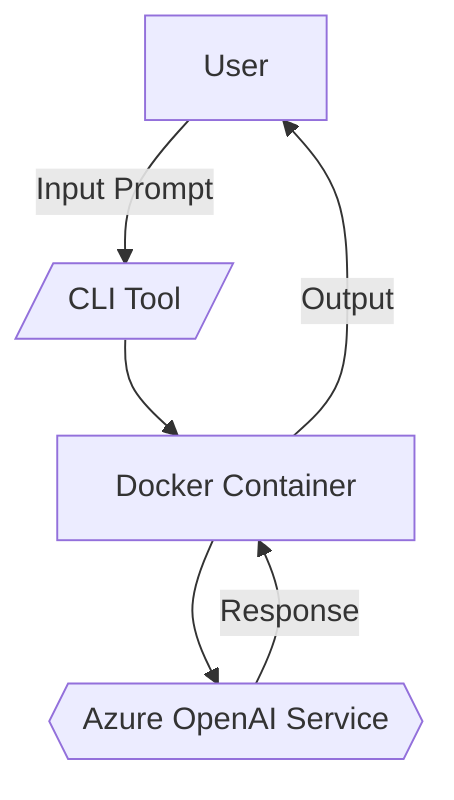
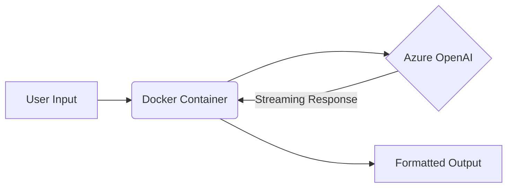
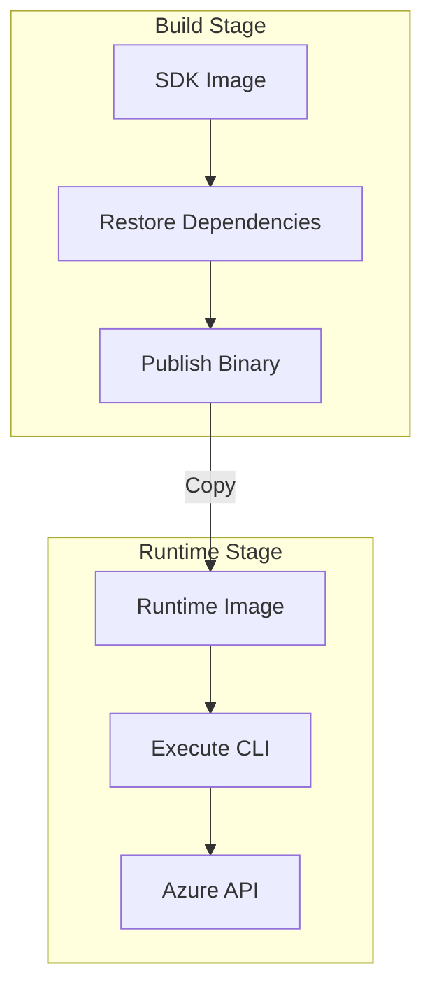

# Azure OpenAI CLI :robot:

## Introduction

Azure OpenAI is a cloud-based service from Microsoft that provides secure access to powerful OpenAI language models through Azure’s infrastructure.
This CLI was created to make it easy for developers, data scientists, and hobbyists to interact with Azure OpenAI from their local terminal in a secure, containerized way — without having to write boilerplate code or manage complex SDK setups.

**Example Use Case:**
> “Quickly generate a Python script that processes CSV files and summarizes the data using natural language.”

A secure, containerized command-line interface for interacting with Azure OpenAI services


*Figure 1: A user types a prompt into the CLI, which runs inside a Docker container. The container sends the request to Azure OpenAI and returns the AI’s response back to the user.*


## :package: Features
- **Secure Containerization** - Runs in isolated Docker environment
- **Simple Interface** - Single command execution
- **Configurable** - Easy environment variable setup
- **Cross-platform** - Works on Windows/Linux/macOS

## :rocket: Quick Start

### Prerequisites
- [Docker](https://www.docker.com/) installed
- Azure OpenAI credentials

> **Note:** All `make` commands shown in this README **must** be run from the repository root directory.

You will also need to create a `.env` file **before** building the CLI.
Follow Microsoft’s official documentation to set up Azure OpenAI and obtain:
- **Endpoint URL** – [Azure OpenAI endpoint setup guide](https://learn.microsoft.com/en-us/azure/ai-services/openai/how-to/create-resource)
- **Model Deployment Name** – [Model deployment guide](https://learn.microsoft.com/en-us/azure/ai-services/openai/how-to/deploy-models)
- **API Key** – [Get your API key](https://learn.microsoft.com/en-us/azure/ai-services/openai/how-to/create-resource#retrieve-key-and-endpoint)

**Sample `.env` file with placeholders:**
```ini
AZUREOPENAIENDPOINT=https://your-resource.openai.azure.com/
AZUREOPENAIMODEL=your-model-deployment
AZUREOPENAIAPI=your-api-key
SYSTEMPROMPT=You are a helpful AI assistant
```

```bash
# 1. Clone repository
git clone https://github.com/SchwartzKamel/azure-openai-cli.git
cd azure-openai-cli

# 2. Configure environment
cp azureopenai-cli/.env.example azureopenai-cli/.env
nano azureopenai-cli/.env  # Add your Azure credentials

# 3. Build & Run
make build
make run ARGS="Explain quantum computing in simple terms"
```

## :wrench: Configuration

Edit `.env` file:
```ini
AZUREOPENAIENDPOINT=https://your-resource.openai.azure.com/
AZUREOPENAIMODEL=your-deployment-name
AZUREOPENAIAPI=your-api-key
SYSTEMPROMPT=You are a helpful AI assistant
```

## Glossary

- **Environment Variable** – A key-value pair stored outside your code that configures how programs run (e.g., API keys, endpoints).
- **Container** – A lightweight, isolated environment (like a mini virtual machine) that packages your application and its dependencies.
- **SDK Image** – A pre-built Docker image containing the Software Development Kit and tools needed to build or run the CLI.

## :beginner: First Run Example

Once your `.env` file is set up and Docker is running:

```bash
make run ARGS="Hello world!"
```

**Expected Output:**
```
> Sending prompt to Azure OpenAI...
Hello world! Nice to meet you.
```

This confirms your CLI can connect to Azure OpenAI successfully.

## :bulb: Usage Examples

```bash
# Simple query
make run ARGS="How do I bake sourdough bread?"

# Technical explanation
make run ARGS="Explain neural networks using a cooking analogy"

# Code generation
make run ARGS="Write a Python function to calculate Fibonacci sequence"
```



## :beginner: Troubleshooting

Here are some common issues and how to resolve them:

- **Docker not running** – Ensure Docker Desktop (Windows/macOS) or the Docker daemon (Linux) is running before executing `make` commands.
  Verify with:
  ```bash
  docker ps
  ```

- **Invalid API key** – Double-check your `.env` file for typos. You can test connectivity by running:
  ```bash
  make run ARGS="Hello"
  ```
  If you get an authentication error, regenerate your key in the Azure Portal.

- **Quota exceeded** – Your Azure OpenAI subscription may have reached its usage limits. Check your quota in the Azure Portal.

- **Unknown make command** – Run:
  ```bash
  make help
  ```
  to see all available commands.

---

## Platform-Specific Prerequisites

Before running the CLI, ensure the following tools are installed on your system:

### Windows
- Install **Docker Desktop**: [Download here](https://www.docker.com/products/docker-desktop)
- Install **Make**:
  1. Install via [Chocolatey](https://chocolatey.org/install):
     ```powershell
     choco install make
     ```
  2. Or via [Scoop](https://scoop.sh/):
     ```powershell
     scoop install make
     ```

### macOS
- Install **Docker Desktop**: [Download here](https://www.docker.com/products/docker-desktop)
- Install **Make** (usually pre-installed, otherwise via [Homebrew](https://brew.sh/)):
  ```bash
  brew install make
  ```

### Linux (Debian/Ubuntu)
```bash
sudo apt update
sudo apt install docker.io make
```

Verify installations:
```bash
docker --version
make --version
```

---

## :beginner: Tips for New Users
 1. **Test your setup** with `make run ARGS="Hello world!"`
 2. Use `make alias` to create shortcut: `az-ai "your prompt"`
 3. Check Docker logs if you get timeout errors
 4. Keep your `.env` file secure - never commit it!

## :octopus: Architecture Overview



## Security Note

Your `.env` file contains sensitive information such as API keys and endpoints.
This file is intentionally listed in `.gitignore` so it will not be committed to version control.

**Best Practices:**
- Never share your `.env` file publicly.
- If you suspect your API key has been exposed, regenerate it immediately in the Azure Portal.
- Keep backups of `.env` files in secure, encrypted storage if needed.

---

## :handshake: Contribution
1. Fork the repository
2. Create feature branch (`git checkout -b feature/amazing-feature`)
3. Commit changes (`git commit -m 'Add amazing feature'`)
4. Push to branch (`git push origin feature/amazing-feature`)
5. Open Pull Request

📝 _Need help? Open an issue with your question!_
