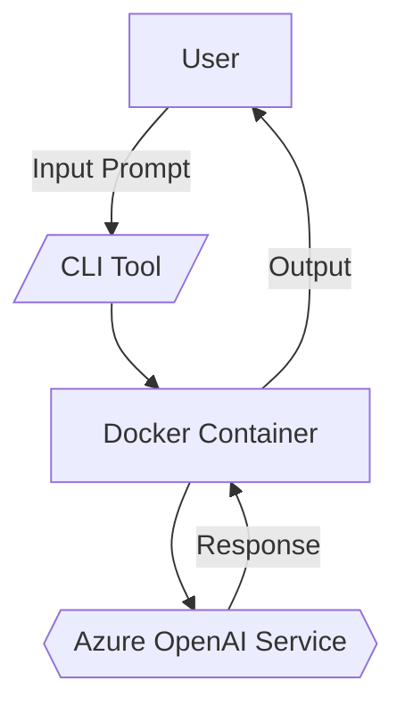
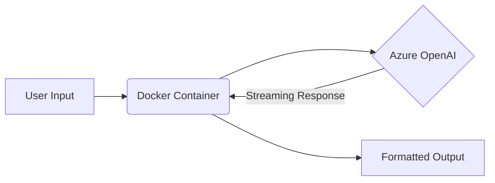
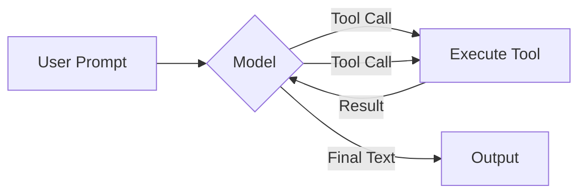
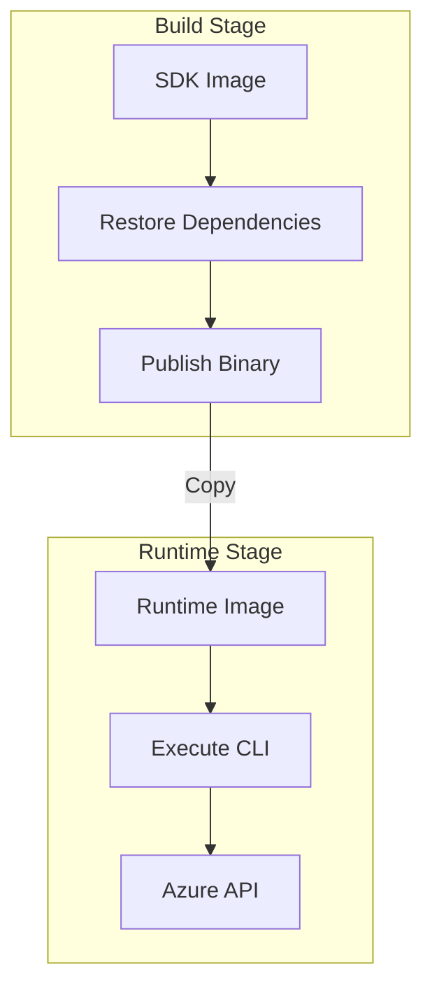

# Azure OpenAI CLI :robot:

[](https://github.com/SchwartzKamel/azure-openai-cli/actions/workflows/ci.yml)
[](https://github.com/SchwartzKamel/azure-openai-cli/actions/workflows/release.yml)
[](LICENSE)
[](https://dotnet.microsoft.com/)
[](Dockerfile)

## Documentation

- [Architecture](ARCHITECTURE.md) — system design and component details
- [Security](SECURITY.md) — security model, credential management, hardening
- [Text Expansion (Espanso/AHK)](docs/espanso-ahk-integration.md) — use `az-ai` as a text expansion backend

## Introduction

Azure OpenAI is a cloud-based service from Microsoft that provides secure access to powerful OpenAI language models through Azure’s infrastructure.
This CLI was created to make it easy for developers, data scientists, and hobbyists to interact with Azure OpenAI from their local terminal in a secure, containerized way — without having to write boilerplate code or manage complex SDK setups.

**Example Use Case:**
> “Quickly generate a Python script that processes CSV files and summarizes the data using natural language.”

A secure, containerized command-line interface for interacting with Azure OpenAI services

### Testing



```mermaid
%% Architecture Diagram
flowchart TB
    User[User] -->|Input Prompt| CLI[/CLI Tool/]
    CLI --> Docker[Docker Container]
    Docker --> Azure{{Azure OpenAI Service}}
    Azure -->|Response| Docker
    Docker -->|Output| User
```
*Figure 1: A user types a prompt into the CLI, which runs inside a Docker container. The container sends the request to Azure OpenAI and returns the AI’s response back to the user.*


## :package: Features
- **Secure Containerization** - Runs in isolated Docker environment
- **Simple Interface** - Single command execution
- **Configurable** - Easy environment variable setup
- **Cross-platform** - Works on Windows/Linux/macOS
- **Agentic Mode** - `--agent` flag enables tool-calling (shell, file, web, clipboard, datetime, delegate)
- **Ralph Mode** - `--ralph` flag enables autonomous self-correcting agent loops with external validation
- **Persona System** - `--persona` flag selects AI team members with persistent memory (inspired by Squad)
- **Streaming** - Real-time token streaming with spinner
- **JSON Output** - `--json` flag for scripted workflows
- **Stdin Pipe** - Pipe content into prompts
- **Multi-Model** - Configure and switch between deployments

## :rocket: Quick Start

### Prerequisites
- [Docker](https://www.docker.com/) installed
- Azure OpenAI credentials

> **New here?** Run `make setup` to install all prerequisites (.NET 10 SDK, Docker, clipboard tools) automatically.
> The script detects your OS and walks you through each step. Use `--skip-docker` to skip Docker, or `--help` for options.

> **Note:** All `make` commands shown in this README **must** be run from the repository root directory.

You will need Azure OpenAI credentials before running the CLI.
Follow Microsoft’s official documentation to set up Azure OpenAI and obtain:
- **Endpoint URL** – [Azure OpenAI endpoint setup guide](https://learn.microsoft.com/en-us/azure/ai-services/openai/how-to/create-resource)
- **Model Deployment Name** – [Model deployment guide](https://learn.microsoft.com/en-us/azure/ai-services/openai/how-to/deploy-models)
- **API Key** – [Get your API key](https://learn.microsoft.com/en-us/azure/ai-services/openai/how-to/create-resource#retrieve-key-and-endpoint)

> **Security:** Credentials are **never baked into the Docker image**. They are injected at runtime via `--env-file`. See [Security](SECURITY.md) for details.

```bash
# 1. Clone repository
git clone https://github.com/SchwartzKamel/azure-openai-cli.git
cd azure-openai-cli

# 2. Create your .env file from the template
cp azureopenai-cli/.env.example .env
nano .env  # Add your Azure credentials

# 3. Build the image (no credentials needed at build time)
make build

# 4. Run (credentials injected at runtime via --env-file)
make run ARGS="Explain quantum computing in simple terms"
```

## :wrench: Configuration

Edit the `.env` file you created during setup. See `azureopenai-cli/.env.example` for the template.

### Configuration Reference

| Variable | Source | Default | Description |
|----------|--------|---------|-------------|
| `AZUREOPENAIENDPOINT` | `.env` | *(required)* | Azure OpenAI endpoint URL |
| `AZUREOPENAIAPI` | `.env` | *(required)* | Azure OpenAI API key |
| `AZUREOPENAIMODEL` | `.env` | *(required)* | Model deployment name(s), comma-separated |
| `SYSTEMPROMPT` | `.env` | *(built-in)* | System prompt for the AI |
| `AZURE_MAX_TOKENS` | `.env` | `10000` | Maximum output tokens (CLI-validated: 1–128000) |
| `AZURE_TEMPERATURE` | `.env` | `0.55` | Response temperature (CLI-validated: 0.0–2.0) |
| `AZURE_TIMEOUT` | `.env` | `120` | Streaming timeout in seconds |

## :repeat: Model Selection

If you have multiple Azure OpenAI model deployments, you can configure and switch between them:

**Configure multiple models** in your `.env` file (comma-separated):
```ini
AZUREOPENAIMODEL=gpt-4,gpt-35-turbo,gpt-4o
```

**Available commands:**
```bash
# List all available models (* marks the active one)
make run ARGS="--models"

# Show the currently active model
make run ARGS="--current-model"

# Switch to a different model
make run ARGS="--set-model gpt-4o"
```

**Example output:**
```
Available models:
  gpt-4
→ gpt-35-turbo *
  gpt-4o

Config file: ~/.azureopenai-cli.json
```

Your model selection is persisted in `~/.azureopenai-cli.json` and will be remembered across sessions.

## Glossary

- **Environment Variable** – A key-value pair stored outside your code that configures how programs run (e.g., API keys, endpoints).
- **Container** – A lightweight, isolated environment (like a mini virtual machine) that packages your application and its dependencies.
- **SDK Image** – A pre-built Docker image containing the Software Development Kit and tools needed to build or run the CLI.

## :beginner: First Run Example

Once your `.env` file is set up and Docker is running:

```bash
make run ARGS="Hello world!"
```

**Expected Output:**
```
> Sending prompt to Azure OpenAI...
Hello world! Nice to meet you.
```

This confirms your CLI can connect to Azure OpenAI successfully.

## :bulb: Usage Examples

```bash
# Simple query
make run ARGS="How do I bake sourdough bread?"

# Technical explanation
make run ARGS="Explain neural networks using a cooking analogy"

# Code generation
make run ARGS="Write a Python function to calculate Fibonacci sequence"
```


```mermaid
%% Workflow Diagram
flowchart LR
    A[User Input] --> B(Docker Container)
    B --> C{Azure OpenAI}
    C -->|Streaming Response| B
    B --> D[Formatted Output]
```

## :keyboard: Text Expansion (Espanso / AutoHotKey)

The **primary use case** for this CLI is as a text expansion backend. Type a trigger phrase anywhere on your OS → get AI-generated text back in-place. No browser tabs, no context switches.

```yaml
# ~/.config/espanso/match/ai.yml — fix grammar with a trigger phrase
matches:
  - trigger: ":aifix"
    replace: "{{output}}"
    vars:
      - name: output
        type: shell
        params:
          cmd: "xclip -selection clipboard -o | az-ai --raw --system 'Fix grammar and spelling. Output ONLY the corrected text, nothing else.'"
```

The `--raw` flag is essential — it strips the spinner, token stats, and trailing newline so only clean text is injected.

> **Full guide with Espanso configs, AHK v2 scripts, macOS/Windows variants, performance tips, and troubleshooting:** [docs/espanso-ahk-integration.md](docs/espanso-ahk-integration.md)

## :zap: Agent Mode

Agent mode (`--agent`) enables the AI model to call built-in tools before responding. This lets the model gather real-time data, read files, and run commands to produce grounded answers.

```bash
# Check the time
az-ai --agent "What time is it in Tokyo?"

# Read and summarize a file
az-ai --agent "Summarize README.md"

# Run a command and explain the output
az-ai --agent "Run 'git log --oneline -5' and summarize recent changes"

# Combine with JSON output
az-ai --agent --json "What's my current directory?"

# Restrict to specific tools
az-ai --agent --tools datetime,file "Read my config and tell me the date"

# Limit tool-calling rounds
az-ai --agent --max-rounds 3 "Complex multi-step task"
```

### Built-in Tools

| Tool | Short Name | Description |
|------|-----------|-------------|
| `shell_exec` | `shell` | Run shell commands (sandboxed, timeout, blocked dangerous commands) |
| `read_file` | `file` | Read file contents (size-capped) |
| `web_fetch` | `web` | HTTP GET a URL (HTTPS-only, timeout) |
| `get_clipboard` | `clipboard` | Read system clipboard text |
| `get_datetime` | `datetime` | Current date/time with timezone support |
| `delegate_task` | `delegate` | Spawn a child agent to handle a subtask (depth-capped) |

### How It Works


```mermaid
flowchart LR
    P[User Prompt] --> M{Model}
    M -->|Tool Call| T[Execute Tool]
    T -->|Result| M
    M -->|Tool Call| T
    M -->|Final Text| O[Output]
```

The model decides when to use tools. Without `--agent`, the CLI behaves exactly as before — zero overhead, no tool loading.

## :brain: Ralph Mode — Autonomous Wiggum Loop

Ralph mode (`--ralph`) takes agent mode to the next level: a fully autonomous, self-correcting loop inspired by [ghuntley's "Ralph Wiggum" technique](https://ghuntley.com/specs). The idea is deceptively simple — give the agent a task, let it try, validate the result with a deterministic command, and if it fails, feed the errors back as context and try again. State persists through files, not conversation history. Each iteration starts fresh.

```
Task → Agent Loop → [Validation] → Pass? → Done ✓
                ↑        ↓ (fail)
                └── Error Context ──┘
```

### Ralph Mode Flags

| Flag | Description |
|------|-------------|
| `--ralph` | Enable autonomous loop mode (implies `--agent`) |
| `--validate <cmd>` | External validation command (tests, linter, build) run after each iteration |
| `--task-file <path>` | Read the task prompt from a file instead of CLI args |
| `--max-iterations <n>` | Maximum loop iterations before giving up (default: 10, max: 50) |

### How It Works

1. **Read task** — from `--task-file` or remaining CLI arguments
2. **Run agent loop** — full agentic mode with all available tools
3. **Validate** — if `--validate` is set, run the command (e.g. `dotnet test`, `npm run lint`)
4. **Pass?** — if validation exits `0`, stop and output the result
5. **Fail?** — capture stderr/stdout, feed it back as new prompt context, loop again
6. **Exhausted?** — if `--max-iterations` is reached, stop and report the final state
7. Each iteration is **stateless** — fresh message history. State persists via **files on disk**
8. A `.ralph-log` file records iteration history for debugging

### Usage Examples

```bash
# Autonomous code fix — keeps trying until all tests pass
az-ai --ralph --validate "dotnet test" --task-file TASK.md

# Self-correcting refactor without external validation
az-ai --ralph "refactor the auth module to use JWT tokens"

# Capped iterations with restricted tools
az-ai --ralph --max-iterations 5 --tools shell,file "fix all compiler warnings in src/"

# Lint-driven cleanup — loop until the linter is happy
az-ai --ralph --validate "npm run lint" "fix all ESLint errors in the project"
```

### Why It Works

The Wiggum method exploits a key insight: LLMs are bad at knowing when they're wrong, but **compilers and test suites are great at it**. By pairing an LLM's ability to write code with a deterministic validator, you get a loop that converges on correct solutions. File-based state means the agent can read its own previous output, see what changed, and course-correct — without needing to fit an entire conversation history into the context window.

## :performing_arts: Persona System — AI Team Members

Inspired by [bradygaster/squad](https://github.com/bradygaster/squad), the persona system gives you a team of specialized AI agents — each with its own role, system prompt, tools, and **persistent memory**. Knowledge compounds across sessions: the more you use a persona, the better it knows your project.

### Quick Start

```bash
# 1. Scaffold your squad (creates .squad.json + .squad/ directory)
az-ai --squad-init

# 2. Use a specific persona
az-ai --persona coder "implement the login page"

# 3. Auto-route to the best persona based on your task
az-ai --persona auto "review the auth module for security issues"

# 4. List available personas
az-ai --personas
```

### Default Personas

| Persona | Role | Tools | Focus |
|---------|------|-------|-------|
| `coder` | Software Engineer | shell, file, web, datetime | Clean, tested, production-ready code |
| `reviewer` | Code Reviewer | file, shell | Bugs, security issues, code quality |
| `architect` | System Architect | file, web, datetime | Design, trade-offs, structural decisions |
| `writer` | Technical Writer | file, shell | Clear, accurate documentation |
| `security` | Security Auditor | file, shell, web | Vulnerabilities, hardening, compliance |

### Auto-Routing

With `--persona auto`, the CLI matches keywords in your prompt against routing rules defined in `.squad.json` and selects the best persona automatically:

```bash
# Routes to "coder" (matches: implement, build, fix, refactor, feature, bug)
az-ai --persona auto "implement JWT authentication"

# Routes to "security" (matches: security, vulnerability, cve, owasp, harden)
az-ai --persona auto "check for OWASP Top 10 vulnerabilities"

# Routes to "writer" (matches: document, readme, docs, guide, tutorial)
az-ai --persona auto "write a getting started guide"
```

### Custom Personas

Edit `.squad.json` to add, remove, or customize personas:

```json
{
  "team": { "name": "My Team", "description": "Custom AI squad" },
  "personas": [
    {
      "name": "devops",
      "role": "DevOps Engineer",
      "description": "CI/CD, infrastructure, and deployment",
      "system_prompt": "You are a DevOps engineer. Focus on CI/CD pipelines, infrastructure as code, and deployment automation.",
      "tools": ["shell", "file", "web"],
      "model": "gpt-4o"
    }
  ],
  "routing": [
    {
      "pattern": "deploy,pipeline,ci,cd,infrastructure,terraform,docker",
      "persona": "devops",
      "description": "DevOps and infrastructure tasks"
    }
  ]
}
```

Each persona can optionally specify a `model` override — use a cheaper model for simple tasks or a more capable one for complex analysis.

### Persistent Memory

Each persona accumulates knowledge across sessions in `.squad/history/<name>.md`. When you invoke a persona, its history is loaded as additional context — it remembers what it learned about your project.

```
.squad/
├── history/          # Per-persona memory (auto-managed)
│   ├── coder.md      # What the coder learned about your project
│   ├── reviewer.md   # Patterns the reviewer has noted
│   └── ...
├── decisions.md      # Shared decision log across all personas
└── README.md         # How the squad works
```

**Commit the `.squad/` directory.** Anyone who clones your repo inherits the full team — with all their accumulated project knowledge.

### How It Differs from Squad

This system is inspired by [bradygaster/squad](https://github.com/bradygaster/squad) but built as native C# — no npm, no Copilot SDK, no new dependencies:

| Feature | Squad (Node.js) | This CLI (C#) |
|---------|-----------------|---------------|
| Runtime | Node.js / npm | .NET 10, Docker-first |
| AI Backend | GitHub Copilot | Azure OpenAI (direct) |
| Config format | Markdown + TypeScript SDK | JSON (`.squad.json`) |
| Dependencies | npm packages, Copilot SDK | Zero new deps (`System.Text.Json` only) |
| Agent execution | Copilot agent sessions | Native tool-calling loop |
| Memory | `.squad/` markdown files | `.squad/history/` markdown files |
| Team size | 20 agents (themed) | 5 focused personas (extensible) |

### Persona Flags

| Flag | Description |
|------|-------------|
| `--squad-init` | Scaffold `.squad.json` and `.squad/` directory with default team |
| `--persona <name>` | Select a specific persona by name |
| `--persona auto` | Auto-route to the best persona based on task keywords |
| `--personas` | List all available personas from `.squad.json` |

## :package: Releases

Pre-built binaries and Docker images are published automatically when a version tag is pushed.

### Install from GitHub Releases

Download the binary for your platform from [Releases](https://github.com/SchwartzKamel/azure-openai-cli/releases):

| Platform | File |
|----------|------|
| Linux (glibc) | `azure-openai-cli-linux-x64.tar.gz` |
| Linux (musl/Alpine) | `azure-openai-cli-linux-musl-x64.tar.gz` |
| Windows | `azure-openai-cli-win-x64.zip` |
| macOS (Intel) | `azure-openai-cli-osx-x64.tar.gz` |
| macOS (Apple Silicon) | `azure-openai-cli-osx-arm64.tar.gz` |

```bash
# Example: Linux x64
tar xzf azure-openai-cli-linux-x64.tar.gz
chmod +x AzureOpenAI_CLI
./AzureOpenAI_CLI "Hello world"
```

### Install from Docker (GHCR)

```bash
docker pull ghcr.io/schwartzkamel/azure-openai-cli:latest
docker run --rm --env-file .env ghcr.io/schwartzkamel/azure-openai-cli:latest "Hello world"
```

### Creating a Release

```bash
git tag v1.6.0
git push origin v1.6.0
# → CI runs → binaries built → Docker pushed to GHCR → GitHub Release created
```

## :beginner: Troubleshooting

Here are some common issues and how to resolve them:

- **Docker not running** – Ensure Docker Desktop (Windows/macOS) or the Docker daemon (Linux) is running before executing `make` commands.
  Verify with:
  ```bash
  docker ps
  ```

- **Invalid API key** – Double-check your `.env` file for typos. You can test connectivity by running:
  ```bash
  make run ARGS="Hello"
  ```
  If you get an authentication error, regenerate your key in the Azure Portal.

- **Quota exceeded** – Your Azure OpenAI subscription may have reached its usage limits. Check your quota in the Azure Portal.

- **Unknown make command** – Run:
  ```bash
  make help
  ```
  to see all available commands.

---

## Platform-Specific Prerequisites

Before running the CLI, ensure the following tools are installed on your system:

### Windows
- Install **Docker Desktop**: [Download here](https://www.docker.com/products/docker-desktop)
- Install **Make**:
  1. Install via [Chocolatey](https://chocolatey.org/install):
     ```powershell
     choco install make
     ```
  2. Or via [Scoop](https://scoop.sh/):
     ```powershell
     scoop install make
     ```

### macOS
- Install **Docker Desktop**: [Download here](https://www.docker.com/products/docker-desktop)
- Install **Make** (usually pre-installed, otherwise via [Homebrew](https://brew.sh/)):
  ```bash
  brew install make
  ```

### Linux (Debian/Ubuntu)
```bash
sudo apt update
sudo apt install docker.io make
```

Verify installations:
```bash
docker --version
make --version
```

---

## :beginner: Tips for New Users
 1. **Test your setup** with `make run ARGS="Hello world!"`
 2. Run `make help` to see all available targets
 3. Use `make alias` to create shortcut: `az-ai "your prompt"`
 4. Check Docker logs if you get timeout errors
 5. Keep your `.env` file secure - never commit it!

## :octopus: Architecture Overview

For full details, see [Architecture](ARCHITECTURE.md).


```mermaid
graph TD
    subgraph Build Stage
        A[SDK Image] --> B[Restore Dependencies]
        B --> C[Publish Binary]
    end
    
    subgraph Runtime Stage
        D[Runtime Image] --> E[Execute CLI]
        E --> F[Azure API]
    end
    
    C -->|Copy| D
```

## Security Note

Your `.env` file contains sensitive information such as API keys and endpoints.
This file is intentionally listed in `.gitignore` so it will not be committed to version control.
Credentials are injected at runtime via `--env-file` and are never embedded in the Docker image.

For comprehensive security guidance, see [Security](SECURITY.md).

**Best Practices:**
- Never share your `.env` file publicly.
- If you suspect your API key has been exposed, regenerate it immediately in the Azure Portal.
- Keep backups of `.env` files in secure, encrypted storage if needed.

---

## Exit Codes

| Code | Meaning |
|------|---------|
| `0`  | Success |
| `1`  | Validation / usage error |
| `2`  | Azure API error |
| `3`  | Timeout |
| `99` | Unhandled error |

---

## Native AOT Status

**Native AOT is the recommended publish mode** as of the Unreleased section of the [CHANGELOG](CHANGELOG.md). `make publish-aot` produces a ~9 MB self-contained single-file binary with **~11 ms cold start** on Linux x64 — roughly 9× faster than the JIT/ReadyToRun build. This matters for text-injection workflows (Espanso, AutoHotKey) where every invocation pays the startup cost; see [docs/espanso-ahk-integration.md](docs/espanso-ahk-integration.md).

All app-level `IL2026` (trim) and `IL3050` (AOT) warnings are fixed via source-generated `System.Text.Json` (`AppJsonContext` in `JsonGenerationContext.cs`). The remaining warnings at publish time originate from third-party assemblies (`Azure.AI.OpenAI`, `OpenAI`) and do not affect runtime behavior.

- `make publish-aot` — recommended, ~11 ms startup, ~9 MB binary (also aliased as `make publish`).
- `make publish-fast` (alias: `make publish-r2r`) — ReadyToRun self-contained build, ~100 ms startup. Retained for compatibility.

---

## SDK Dependency Note

This project uses `Azure.AI.OpenAI` version **2.9.0-beta.1** (pre-release, required for tool calling support).
The package will be updated to a stable release once Microsoft publishes one with full tool calling support.
See [Dependency Security](SECURITY.md#7-dependency-security) for scanning and update guidance.

---

## :handshake: Contribution
1. Fork the repository
2. Create feature branch (`git checkout -b feature/amazing-feature`)
3. Commit changes (`git commit -m 'Add amazing feature'`)
4. Push to branch (`git push origin feature/amazing-feature`)
5. Open Pull Request

📝 _Need help? Open an issue with your question!_
